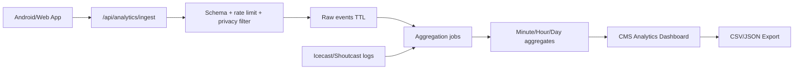

# WXM Analytics Engine Architecture

## Objetivo

Construir una capa de analytics privada para operar WXM ONE RADIO como una emisora real: audiencia en vivo, paises, players, referidores, sesiones de escucha, errores de stream y origen especifico de usuarios que llegan desde la app Android.

## Estado actual

- CMS local muestra un dashboard operativo con datos de muestra seguros.
- La app genera telemetria anonima local en `localStorage`.
- La app puede enviar eventos por HTTPS cuando se configure `analytics.ingestEndpoint`.
- El CMS exporta configuracion analytics dentro de `wxm-cmc.json` y `wxm-cms.json`.
- No existe todavia backend remoto, base de datos ni agregaciones reales.

## Eventos cliente

Eventos minimos ya contemplados:

- `app_open`
- `view_opened`
- `play_request`
- `play_started`
- `play_paused`
- `buffering_started`
- `playback_error`
- `audience_snapshot`
- `metadata_changed`
- `favorite_added`
- `favorite_removed`
- `article_viewed`
- `podcast_viewed`
- `secondary_station_selected`
- `poll_voted`
- `sponsor_opened`
- `request_song_submitted`

## Dimensiones obligatorias

- `sourceClient`: `wxm_android_app`, `wxm_web_app`, `cms_preview`, `external_player`, `tunein`, `alexa`, `unknown`.
- `platform`: `android`, `web`, `ios` futuro.
- `appVersion`.
- `stationId`: `main`, `urban`, `club`, `latino`, `chill` u otros.
- `streamRole`: `primary`, `fallback`, `emergency`, `secondary`.
- `player`.
- `referrer`.
- `sessionId` anonimo.
- `playbackSessionId` anonimo.

## Backend recomendado

## Modelo de datos minimo

### Raw events

- `event_id`
- `event_name`
- `created_at`
- `session_id_hash`
- `playback_session_id_hash`
- `source_client`
- `platform`
- `app_version`
- `station_id`
- `stream_role`
- `player`
- `referrer`
- `country`
- `region`
- `city`
- `network_type`
- `details_json`

### Aggregates

- `bucket_start`
- `bucket_size`
- `station_id`
- `source_client`
- `platform`
- `player`
- `referrer`
- `country`
- `unique_listeners`
- `access_count`
- `listening_seconds`
- `playback_errors`
- `buffering_count`
- `fallback_activations`

## Dashboard CMS requerido

- Dashboard general.
- Quick stats.
- Countries.
- Players.
- Referrers.
- App users.
- Stream health.
- Exports.

## Privacidad y seguridad

- No almacenar nombres, telefonos, emails ni mensajes personales en analytics.
- IP solo para geolocalizacion aproximada; truncar o hashear con rotacion.
- Eventos crudos con retencion corta.
- Agregados con retencion mas amplia.
- Endpoint HTTPS obligatorio.
- CORS restringido.
- Rate limit por IP/origen.
- Tamano maximo de payload.
- Dashboard detras de login, roles y auditoria.

## Proxima implementacion real

1. Crear backend minimo para `/api/analytics/ingest`.
2. Crear tabla append-only de eventos anonimos.
3. Crear jobs de agregacion por minuto/hora/dia.
4. Conectar el CMS a `/api/analytics/dashboard`.
5. Comparar sesiones app con logs del servidor de streaming.
6. Activar export CSV/JSON real.
